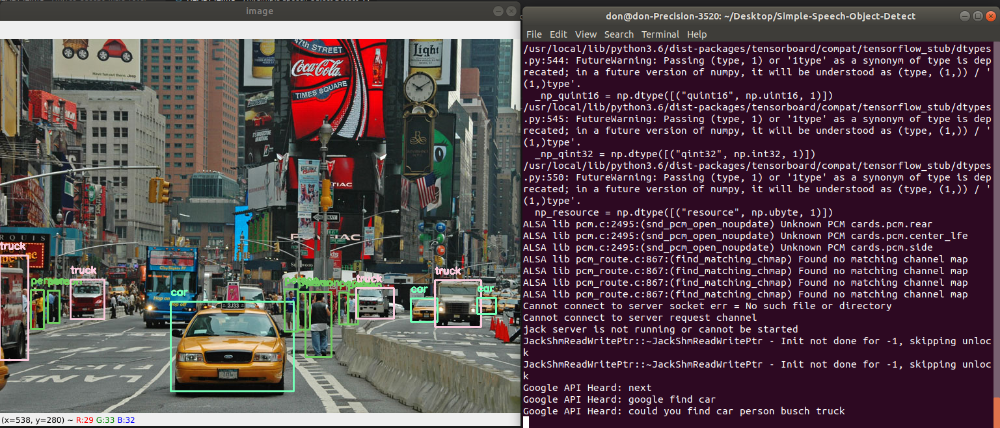

# Simple Speech Object Detection
This program will listen to the objects to be highlighted within an image



## Getting Started
Install the packages needed for this project: cvlib, matplotlib, opencv, pyaudio and speech_recognition

### Demo Run
Open a terminal and go to the project directory . Then run the following command 
```
python3 simple_speech_detect.py
```

Tell the program what objects to be found but remember that only the classic 80 yolo objects can be found.

If the user says "next": It will go to the next image
If the user says "end": The program will end

